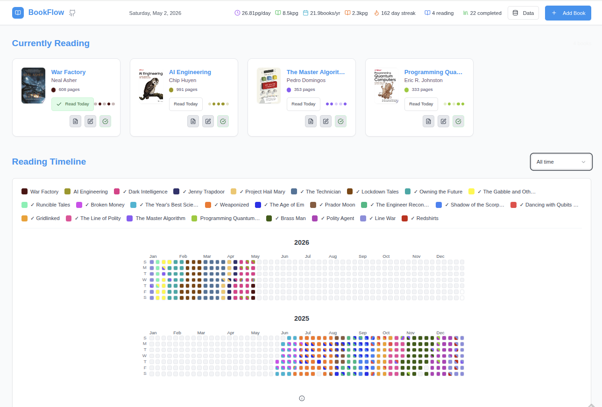

# BookFlow

[](https://opensource.org/licenses/MIT)
[](https://github.com/jlowder/BookFlow/actions/workflows/publish.yml)
[](https://www.typescriptlang.org/)
[](https://playwright.dev/)

BookFlow is a modern web-based reading journal that helps you track what you read, uncover patterns in your habits, and keep a complete history of your literary journey. With a clean, intuitive interface, it's easy to organize your library, monitor progress, and stay motivated along the way.



## Simple Installation (docker)

First, initialize a docker named volume to store the journal:

```sh
docker volume create bookflow_data
```

Then, download and run the docker image. If you want the app to be on a port other than 3000, change the first 3000 to
some other value.

```sh
docker run -d --restart always -d -p 3000:3000 -v bookflow_data:/app/data ghcr.io/jlowder/bookflow/bookflow:latest
```

Then, browse to localhost:3000, or whatever port you chose. The app will be installed permanently; that is, it will persist through reboots.

## Manual Installation

1. Clone the repo:
   ```sh
   git clone https://github.com/jlowder/BookFlow.git
   ```
2. Build the project directory:
   ```sh
   cd BookFlow
   npm install
   docker compose build
   ```
4. Deploy
   ```sh
   docker compose up -d
   ```

## Usage

**Add your current reads to get started.** Search for a title or author and select your book to create a card. Click any card to add personal notes or customize the color used in your timeline view.

**Each day that you read something, click the "Read Today" button.** That's pretty much it! You can mark a book complete by clicking the "Complete" checkmark in the
card (the rightmost button).

**If you need to edit the timeline:** switch to the grid (All Time) view and click the Edit icon (center button in the card). Then,
click any day in the grid to toggle the reading state for that day. Click the Edit icon again when you are done making edits.

**Note:** On smaller screens, the app defaults to a 30-day view instead of the All Time grid. Use your phone for quick updates-like marking books read-but switch to a desktop or tablet for full timeline edits.

## License

MIT

## Contact

Project Link: [https://github.com/jlowder/BookFlow](https://github.com/jlowder/BookFlow)
